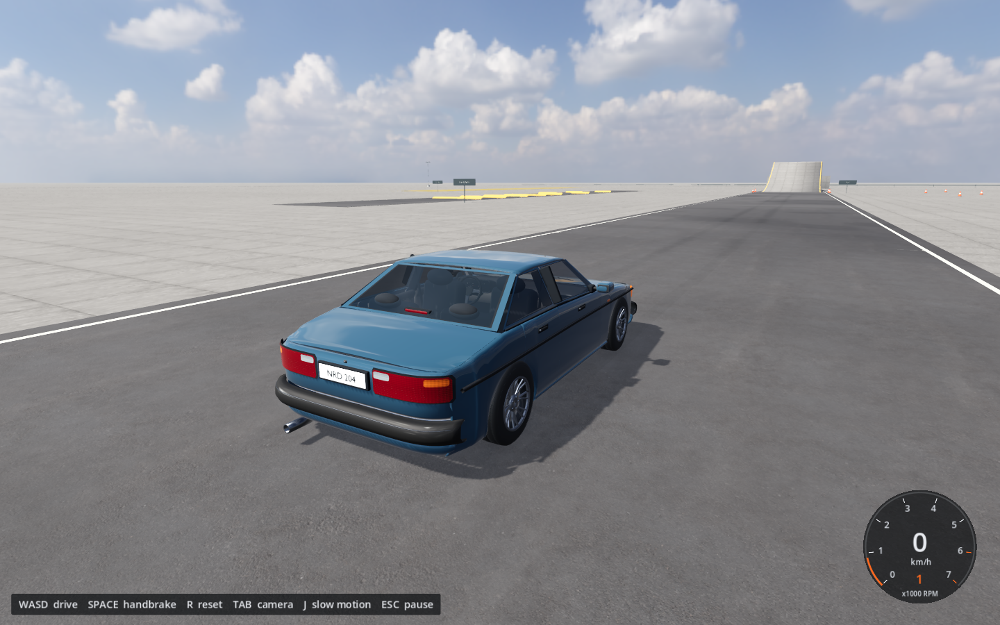

# Vehicle Physics

A Godot driving sandbox with custom suspension, tire forces, impact deformation, and cockpit mirrors. Drive a sedan through ramps, bumps, and crash barriers, or run scripted scenarios that export telemetry.



## Run

Tested with **Godot 4.7.1**, Forward+ rendering, and Jolt Physics on Apple Silicon macOS. Open `project.godot` in Godot and press **F6** on `main.tscn`, or run:

```sh
godot --headless --editor --path . --import
godot --path .
```

A self-contained Apple Silicon build is available in [Releases](https://github.com/dicnunz/vehicle-physics/releases/latest). It requires macOS 13 or later and is ad hoc signed, without Apple notarization.

| Control | Action |
| --- | --- |
| WASD / arrow keys | Drive, brake, reverse |
| Space | Handbrake |
| R | Reset vehicle |
| Tab / C | Change camera |
| Right mouse drag | Look around |
| J | Slow motion |
| Esc | Pause |
| F3 | Frame-rate display |

## Implementation

- `vehicle.gd`: suspension and tire forces applied to a Jolt rigid body at 120 physics ticks per second.
- `deformer.gd`: a 63-node cage with elastic beams, plastic deformation, and breakage, mapped onto the vehicle mesh.
- `mirrors.gd`: reflected camera views rendered into cockpit mirror surfaces.
- `world.gd`, `hud.gd`, `main.gd`: test course, instruments, input, and camera control.

The vehicle model is a compact game-physics approximation. Its deformation cage and analytical tires are not validated against real vehicle crash or handling data.

## Scripted scenarios

After importing the project, run a crash scenario:

```sh
godot --headless --path . -- --gauntlet=crash --qa-output=./qa-output
```

`gauntlet.gd` writes `crash.json` with sampled vehicle telemetry, damage, mesh displacement, and timing, then exits. Other scenarios include `straight`, `brake`, `steer`, `jump`, `rollover`, `cockpit`, and `performance`. Run without `--headless` to capture rendered frames. These are reproducible scenario runners; their output does not by itself establish physical accuracy.

## License

Original project code and assets are available under the [MIT license](LICENSE). Poly Haven textures and sky assets retain their CC0 notices in [`assets/world/cc0/CREDITS.md`](assets/world/cc0/CREDITS.md), [`assets/vehicle/CABIN-TEXTURE-LICENSES.md`](assets/vehicle/CABIN-TEXTURE-LICENSES.md), and [`assets/sky/LICENSE.txt`](assets/sky/LICENSE.txt). Bundled releases include Godot and third-party runtime license notices.
